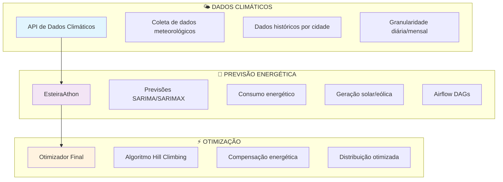

# 🔋 ATHON - Ecossistema de Gestão Energética Inteligente

<div align="center">


**Sistema integrado para análise, previsão e otimização de distribuição energética**

[🌤️ Dados Climáticos](#-dados-climáticos-api) • [🔋 Previsão Energética](#-esteiraathon---previsão-energética) • [⚡ Otimização](#-otimizador-final---compensação-energética)

</div>

---

## 🎯 **Visão Geral do Ecossistema**

Este ecossistema integra três componentes especializados para criar uma solução completa de gestão energética inteligente, desde a coleta de dados climáticos até a otimização de distribuição de compensação energética.



---

## 📊 **Componentes do Sistema**

<table>
<tr>
<td width="33%" align="center">

### 🌤️ **Dados Climáticos API**
[](https://github.com/werikcyano/dados-climaticos-api)

**API especializada para consulta de dados climáticos**

🔹 Dados meteorológicos históricos  
🔹 Consulta por cidade e período  
🔹 Granularidade diária/mensal  
🔹 Cache otimizado  
🔹 FastAPI + Docker  

[📖 Documentação](https://github.com/werikcyano/dados-climaticos-api/blob/main/README.md) | [🚀 Deploy](https://github.com/werikcyano/dados-climaticos-api#executando-com-docker)

</td>
<td width="33%" align="center">

### 🔋 **EsteiraAthon - Previsão Energética**
[](https://github.com/Paulo-H/EsteiraAthon)

**Sistema de previsão de consumo e geração de energia**

🔹 Algoritmos SARIMA/SARIMAX  
🔹 Pipeline Apache Airflow (5 DAGs)  
🔹 Previsão consumo + geração  
🔹 Correlação clima-energia  
🔹 FastAPI + PostgreSQL  

[📖 Documentação](https://github.com/Paulo-H/EsteiraAthon/blob/main/README.md) | [🏗️ Arquitetura](https://github.com/Paulo-H/EsteiraAthon/blob/main/SISTEMA_PREVISAO_ENERGETICA.md)

</td>
<td width="33%" align="center">

### ⚡ **Otimizador Final - Compensação Energética**
[](https://github.com/LeoCBrito/Otimizador_Final)

**Otimização de distribuição de compensação energética**

🔹 Algoritmo Hill Climbing (Julia)  
🔹 Processamento paralelo  
🔹 Otimização multi-objetivo  
🔹 API web assíncrona  
🔹 Python + Julia + FastAPI  

[📖 Documentação](https://github.com/LeoCBrito/Otimizador_Final/blob/main/README.md) | [🎯 Guia de Uso](https://github.com/LeoCBrito/Otimizador_Final/blob/main/GUIA_DE_USO.md)

</td>
</tr>
</table>

---

## 🔄 **Fluxo de Integração**

```
┌─────────────────┐    ┌─────────────────┐    ┌─────────────────┐
│   📊 COLETA     │    │   🧠 ANÁLISE    │    │   ⚡ AÇÃO      │
│                 │    │                 │    │                 │
│ • Dados climat. │───▶│ • Previsões ML  │───▶│ • Otimização    │
│ • APIs externas │    │ • SARIMA/SARIMAX│    │ • Distribuição  │
│ • Histórico     │    │ • Pipeline      │    │ • Compensação   │
└─────────────────┘    └─────────────────┘    └─────────────────┘
```

1. **🌤️ Coleta**: API de dados climáticos fornece dados meteorológicos históricos
2. **🔋 Previsão**: EsteiraAthon usa dados climáticos para prever consumo e geração
3. **⚡ Otimização**: Otimizador Final distribui compensação com base nas previsões

---

## 🚀 **Quick Start**

### 1. Clone o Ecossistema Completo
```bash
# Clone todos os repositórios
git clone https://github.com/werikcyano/dados-climaticos-api.git
git clone https://github.com/Paulo-H/EsteiraAthon.git  
git clone https://github.com/LeoCBrito/Otimizador_Final.git
```

### 2. Execute os Serviços
```bash
# 1. Inicie API de dados climáticos (porta 8000)
cd dados-climaticos-api
docker-compose up -d

# 2. Inicie EsteiraAthon (porta 8000)
cd ../EsteiraAthon  
docker-compose up -d

# 3. Inicie Otimizador (porta 8001)
cd ../Otimizador_Final
docker-compose up -d
```

### 3. Teste a Integração
```bash
# Verifique se todos os serviços estão rodando
curl http://localhost:8000/health  # Dados climáticos
curl http://localhost:8080         # EsteiraAthon (Airflow)
curl http://localhost:8001/health  # Otimizador
```

---

## 🏗️ **Casos de Uso**

| Setor | Aplicação | Componentes Utilizados |
|-------|-----------|----------------------|
| **🏘️ Municipal** | Planejamento energético urbano | Todos os 3 componentes |
| **🔋 Utilities** | Gestão de geração distribuída | EsteiraAthon + Otimizador |
| **🏭 Industrial** | Otimização de consumo | Dados Climáticos + EsteiraAthon |
| **🔬 Pesquisa** | Análise clima-energia | Dados Climáticos + EsteiraAthon |
| **💡 Smart Grid** | Balanceamento da rede | EsteiraAthon + Otimizador |

---

## 📚 **Recursos Adicionais**

### Documentação Técnica
- [🔧 Configuração do Ambiente](./docs/setup.md)
- [🐳 Deploy com Docker](./docs/docker-deployment.md)
- [🔗 Guia de Integração](./docs/integration-guide.md)
- [📊 Exemplos de Uso](./docs/examples.md)

### Suporte
- [❓ FAQ](./docs/faq.md)
- [🐛 Issues](https://github.com/werikcyano/athon-ecosystem/issues)
- [💬 Discussões](https://github.com/werikcyano/athon-ecosystem/discussions)

---

## 👥 **Equipe ATHON**

Desenvolvido para EsteiraAthon 2024 - Sistema de gestão energética inteligente.

**⚡ Ecossistema completo para transformar dados em decisões energéticas otimizadas! 🚀**

---

<div align="center">

[](https://github.com/werikcyano/athon-ecosystem/stargazers)
[](https://github.com/werikcyano/athon-ecosystem/network)

</div>